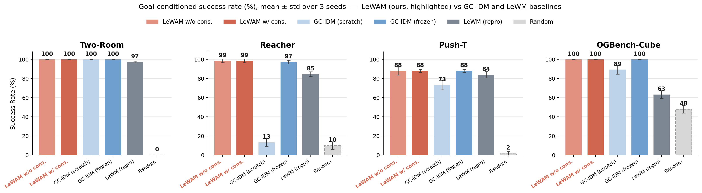
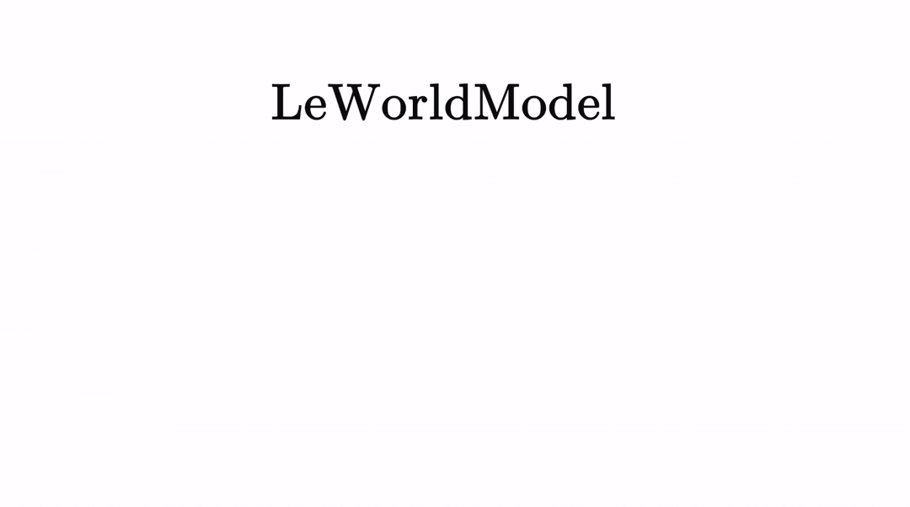

# LeWAM — a Simple, Fast, Scalable World-Action Model

> **New here? Start with [ONBOARDING.md](ONBOARDING.md)** — zero → running training/eval in ~20 min (+ the data pull). It covers context, env, data, the smoke test, and every config-driven setting.

**LeWAM** is a latent JEPA World-Action Model built on **LeWM** (LeWorldModel, arXiv 2603.19312). On top of LeWM's plannable latent it adds a planning-free, history/goal/horizon-conditioned action head, so **one trained model** serves behavior cloning, goal-conditioned policy, and CEM planning. The core contribution is `lewam/models/jepa.py` (model) + `scripts/train.py` (loss) + `configs/train/lewm.yaml` (every setting via `action_pred.*`). Every training setting (BC / goal-conditioned / horizon / inverse-dynamics / cycle) and its loss equation is documented in [`docs/SETTINGS.md`](docs/SETTINGS.md). Deeper context in [`docs/`](docs/) — project rules ([`docs/CLAUDE.md`](docs/CLAUDE.md)), experiment log ([`docs/EXPERIMENTS.md`](docs/EXPERIMENTS.md)), equations ([`docs/results/lewam_equations.html`](docs/results/lewam_equations.html)), asset transfer ([`docs/MACHINE_TRANSFER.md`](docs/MACHINE_TRANSFER.md)).

⚠️ The datasets and checkpoints are **not** in this repo — pull them from HuggingFace (see [Data](#data)) or, for the original assets, ONBOARDING §3.

## Results



Goal-conditioned success rate (%, mean ± std over 3 seeds) from our ablation campaign.
**LeWAM** (with and without the consistency loss) matches or beats every baseline on all four
tasks — GC-IDM (scratch / frozen) and our own CEM-planning **LeWM reproduction**. The
consistency loss makes no measurable difference (w/o ≈ w/).

📊 **[Explore the interactive dashboard](docs/results/dashboard/index.html)** — per-task
success rates, training-convergence curves, the speed benchmark, the consistency-loss
decomposition, and the full LeWM reproduction. Open the HTML locally; GitHub does not render it inline.

> These are results from our experiment campaign, not a one-command reproduction. The figure
> combines three code paths — `scripts/train_lewam_gc.py` (LeWAM), `scripts/train_gcidm.py`
> (GC-IDM scratch / frozen), and `scripts/eval.py` CEM planning (LeWM repro) — plus external
> checkpoints. See [Training](#training).

## Repository layout

```
lewam/                     installable package  (pip install -e .)
  models/    jepa.py · module.py · gip.py · gcidm.py
  data/      goal_dataset.py · multitask_dataset.py
  envs/      robomimic_env.py
  utils.py
scripts/     train.py · eval.py · eval_gip.py · decode_lewm.py
             train_gcidm.py · train_ours_gc.py · train_sigreg.py
configs/     Hydra configs — train/ · eval/ · decode/
docs/        design notes, experiment log, equations
experimental/  one-off research scripts (viz / decoders / converters) — not maintained
```

Everything runs on a plain single-GPU server — there are no cluster or filesystem
assumptions in the code; dataset and checkpoint locations are controlled by the
`STABLEWM_HOME` environment variable (see [Data](#data)).

## Setup

```bash
uv venv --python=3.10
source .venv/bin/activate
uv pip install stable-worldmodel[train,env]   # environments, planning, eval + training deps
uv pip install -e .                            # the lewam package (this repo)
```

`robomimic` is only needed for the robomimic benchmark (`scripts/eval_histbc_robomimic.py`);
install it separately if you use that path.

## Data

Datasets use the HDF5 format for fast loading. Download from [HuggingFace](https://huggingface.co/collections/quentinll/lewm) and decompress:

```bash
tar --zstd -xvf archive.tar.zst
```

Place the extracted `.h5` files under `$STABLEWM_HOME` (defaults to `~/.stable-wm/`), overridable:
```bash
export STABLEWM_HOME=/path/to/your/storage
```

Dataset names are given without the `.h5` extension. E.g. `configs/train/data/pusht.yaml` references `pusht_expert_train`, which resolves to `$STABLEWM_HOME/pusht_expert_train.h5`.

## Training

`lewam/models/jepa.py` is the PyTorch model; the training loss lives in `scripts/train.py`.
Training is configured via [Hydra](https://hydra.cc/) files under `configs/train/`.

Set your WandB `entity`/`project` in `configs/train/lewm.yaml`:
```yaml
wandb:
  config:
    entity: your_entity
    project: your_project
```

Launch:
```bash
python scripts/train.py data=pusht
```

Checkpoints are saved under `$STABLEWM_HOME`.

## Planning / Evaluation

Eval configs live under `configs/eval/`. Set `policy` to the checkpoint path **relative to `$STABLEWM_HOME`**, without the `_object.ckpt` suffix:

```bash
# ✓ correct
python scripts/eval.py --config-name=pusht.yaml policy=pusht/lewm

# ✗ incorrect
python scripts/eval.py --config-name=pusht.yaml policy=pusht/lewm_object.ckpt
```

---

<details>
<summary>Original upstream LeWM README (background)</summary>


# LeWorldModel
### Stable End-to-End Joint-Embedding Predictive Architecture from Pixels

[Lucas Maes*](https://x.com/lucasmaes_), [Quentin Le Lidec*](https://quentinll.github.io/), [Damien Scieur](https://scholar.google.com/citations?user=hNscQzgAAAAJ&hl=fr), [Yann LeCun](https://yann.lecun.com/) and [Randall Balestriero](https://randallbalestriero.github.io/)

**Abstract:** Joint Embedding Predictive Architectures (JEPAs) offer a compelling framework for learning world models in compact latent spaces, yet existing methods remain fragile, relying on complex multi-term losses, exponential moving averages, pretrained encoders, or auxiliary supervision to avoid representation collapse. In this work, we introduce LeWorldModel (LeWM), the first JEPA that trains stably end-to-end from raw pixels using only two loss terms: a next-embedding prediction loss and a regularizer enforcing Gaussian-distributed latent embeddings. This reduces tunable loss hyperparameters from six to one compared to the only existing end-to-end alternative. With ~15M parameters trainable on a single GPU in a few hours, LeWM plans up to 48× faster than foundation-model-based world models while remaining competitive across diverse 2D and 3D control tasks. Beyond control, we show that LeWM's latent space encodes meaningful physical structure through probing of physical quantities. Surprise evaluation confirms that the model reliably detects physically implausible events.

<p align="center">
   <b>[ <a href="https://arxiv.org/pdf/2603.19312v1">Paper</a> | <a href="https://huggingface.co/collections/quentinll/lewm">Checkpoints &amp; Data</a> | <a href="https://le-wm.github.io/">Website</a> ]</b>
</p>

<br>

<p align="center">
  
</p>

If you find this code useful, please reference it in your paper:
```
@article{maes_lelidec2026lewm,
  title={LeWorldModel: Stable End-to-End Joint-Embedding Predictive Architecture from Pixels},
  author={Maes, Lucas and Le Lidec, Quentin and Scieur, Damien and LeCun, Yann and Balestriero, Randall},
  journal={arXiv preprint},
  year={2026}
}
```

## Using the code
This codebase builds on [stable-worldmodel](https://github.com/galilai-group/stable-worldmodel) for environment management, planning, and evaluation, and [stable-pretraining](https://github.com/galilai-group/stable-pretraining) for training. Together they reduce this repository to its core contribution: the model architecture and training objective.

**Installation:**
```bash
uv venv --python=3.10
source .venv/bin/activate
uv pip install stable-worldmodel[train,env]
```

## Data

Datasets use the HDF5 format for fast loading. Download the data from [HuggingFace](https://huggingface.co/collections/quentinll/lewm) and decompress with:

```bash
tar --zstd -xvf archive.tar.zst
```

Place the extracted `.h5` files under `$STABLEWM_HOME` (defaults to `~/.stable-wm/`). You can override this path:
```bash
export STABLEWM_HOME=/path/to/your/storage
```

Dataset names are specified without the `.h5` extension. For example, `configs/train/data/pusht.yaml` references `pusht_expert_train`, which resolves to `$STABLEWM_HOME/pusht_expert_train.h5`.

## Training

`lewam/models/jepa.py` contains the PyTorch implementation of LeWM. Training is configured via [Hydra](https://hydra.cc/) config files under `configs/train/`.

Before training, set your WandB `entity` and `project` in `configs/train/lewm.yaml`:
```yaml
wandb:
  config:
    entity: your_entity
    project: your_project
```

To launch training:
```bash
python scripts/train.py data=pusht
```

Checkpoints are saved to `$STABLEWM_HOME` upon completion.

For baseline scripts, see the stable-worldmodel [scripts](https://github.com/galilai-group/stable-worldmodel/tree/main/scripts/train) folder.

## Planning

Evaluation configs live under `configs/eval/`. Set the `policy` field to the checkpoint path **relative to `$STABLEWM_HOME`**, without the `_object.ckpt` suffix:

```bash
# ✓ correct
python scripts/eval.py --config-name=pusht.yaml policy=pusht/lewm

# ✗ incorrect
python scripts/eval.py --config-name=pusht.yaml policy=pusht/lewm_object.ckpt
```

## Pretrained Checkpoints

Pretrained LeWM checkpoints for each environment are mirrored on the Hugging Face
Hub (model repos), alongside the datasets (dataset repos) in the same collection:

- [`quentinll/lewm-pusht`](https://huggingface.co/quentinll/lewm-pusht)
- [`quentinll/lewm-cube`](https://huggingface.co/quentinll/lewm-cube)
- [`quentinll/lewm-tworooms`](https://huggingface.co/quentinll/lewm-tworooms)
- [`quentinll/lewm-reacher`](https://huggingface.co/quentinll/lewm-reacher)

The full baseline checkpoint suite (PLDM, LeJEPA, IVL, IQL, GCBC, DINO-WM, DINO-WM-noprop)
is available on [Google Drive](https://drive.google.com/drive/folders/1r31os0d4-rR0mdHc7OlY_e5nh3XT4r4e):

<div align="center">

| Method | two-room | pusht | cube | reacher |
|:---:|:---:|:---:|:---:|:---:|
| pldm | ✓ | ✓ | ✓ | ✓ |
| lejepa | ✓ | ✓ | ✓ | ✓ |
| ivl | ✓ | ✓ | ✓ | — |
| iql | ✓ | ✓ | ✓ | — |
| gcbc | ✓ | ✓ | ✓ | — |
| dinowm | ✓ | ✓ | — | — |
| dinowm_noprop | ✓ | ✓ | ✓ | ✓ |

</div>

## Loading a checkpoint

### From the Drive archive

Each tar archive contains two files per checkpoint:
- `<name>_object.ckpt` — a serialized Python object for convenient loading; this is what `scripts/eval.py` and the `stable_worldmodel` API use
- `<name>_weight.ckpt` — a weights-only checkpoint (`state_dict`) for cases where you want to load weights into your own model instance

Place the extracted files under `$STABLEWM_HOME/` and load via:

```python
import stable_worldmodel as swm

# Load the cost model (for MPC)
cost = swm.policy.AutoCostModel('pusht/lewm')
```

`AutoCostModel` accepts:
- `run_name` — checkpoint path **relative to `$STABLEWM_HOME`**, without the `_object.ckpt` suffix
- `cache_dir` — optional override for the checkpoint root (defaults to `$STABLEWM_HOME`)

The returned module is in `eval` mode with its PyTorch weights accessible via `.state_dict()`.

### From the Hugging Face mirror

The HF model repos ship the LeWM checkpoint as a `weights.pt` (state dict) plus a
`config.json` describing the model. Convert once to produce the `_object.ckpt`
that `scripts/eval.py` expects:

```bash
# download weights.pt + config.json
hf download quentinll/lewm-pusht --local-dir $STABLEWM_HOME/hf_pusht

# convert to object checkpoint under $STABLEWM_HOME/pusht/lewm_object.ckpt
python - <<'PY'
import json, torch, stable_pretraining as spt
from pathlib import Path
from lewam.models.jepa import JEPA
from lewam.models.module import ARPredictor, Embedder, MLP
import stable_worldmodel as swm

src = Path(swm.data.utils.get_cache_dir(), "hf_pusht")
out = Path(swm.data.utils.get_cache_dir(), "pusht", "lewm_object.ckpt")

cfg = json.loads((src / "config.json").read_text())
encoder = spt.backbone.utils.vit_hf(
    cfg["encoder"]["size"],
    patch_size=cfg["encoder"]["patch_size"],
    image_size=cfg["encoder"]["image_size"],
    pretrained=False, use_mask_token=False,
)
mlp = lambda k: MLP(input_dim=cfg[k]["input_dim"], output_dim=cfg[k]["output_dim"],
                    hidden_dim=cfg[k]["hidden_dim"], norm_fn=torch.nn.BatchNorm1d)
model = JEPA(
    encoder=encoder,
    predictor=ARPredictor(**cfg["predictor"]),
    action_encoder=Embedder(**cfg["action_encoder"]),
    projector=mlp("projector"),
    pred_proj=mlp("pred_proj"),
)
sd = torch.load(src / "weights.pt", map_location="cpu", weights_only=False)
model.load_state_dict(sd, strict=True)
out.parent.mkdir(parents=True, exist_ok=True)
torch.save(model, out)
PY
```

After conversion, load via `swm.policy.AutoCostModel('pusht/lewm')` as usual.

## Contact & Contributions
Feel free to open [issues](https://github.com/lucas-maes/le-wm/issues)! For questions or collaborations, please contact `lucas.maes@mila.quebec`

</details>
